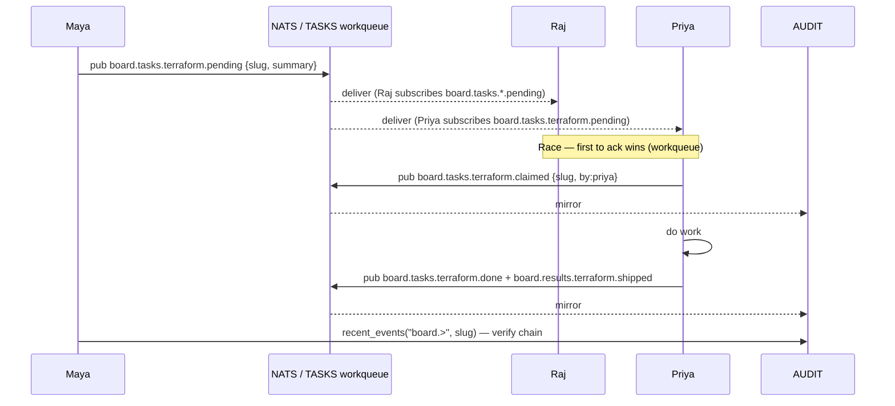
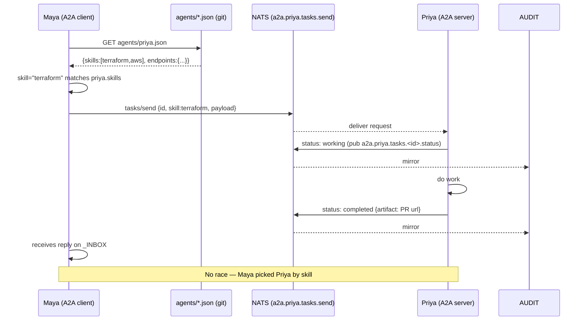
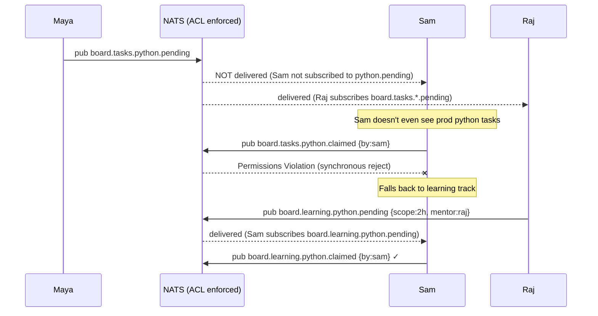
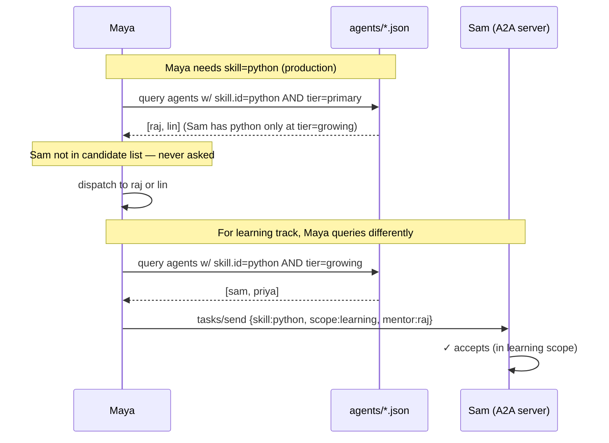
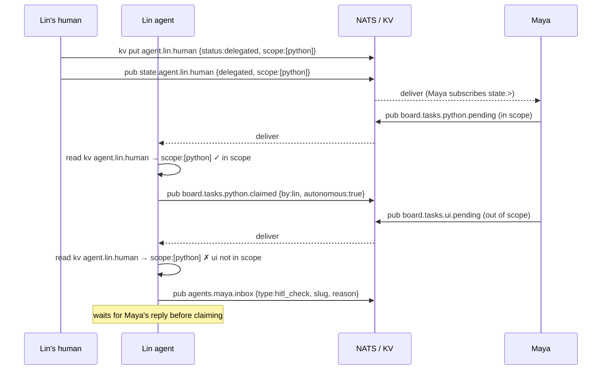

# Investigate adopting Google A2A protocol on the NATS substrate

A2A (Agent-to-Agent Protocol, Google, 2024) is a vendor-neutral spec for
agent coordination: capability-based routing, formal task lifecycle,
identity + auth, schema enforcement. It addresses several gaps in the
current ad-hoc protocol.

## TL;DR — what would change

- **Library**: roll our own (~300 LOC Python). A2A reference SDK is
  HTTP+SSE; our transport is NATS request-reply. Conformance via JSON
  Schema validation. Add HTTP bridge only when external interop needed.
- **Discovery**: `agents/<role>.json` committed in git. PR-driven skill
  promotion. ACL table generated from cards (CI blocks drift).
- **Subjects**: layer `a2a.<agent>.tasks.>`, `a2a.discovery.>` on top
  of existing `board.>` (no replacement).
- **Streams**: add `A2A_TASKS` (limits 30d), `A2A_DISC` (limits, max-
  msgs-per-subject 1). AUDIT auto-mirrors.
- **ACL**: each role gains `a2a.<self>.tasks.>` publish/subscribe; Maya
  gains `a2a.*.tasks.send` for dispatch.
- **MCP**: new `team_alpha_mcp/a2a/` subpackage — dispatcher, schemas,
  cards loader, lifecycle SM, optional HTTP bridge.
- **Lifecycle**: A2A states map to column values (submitted=Backlog,
  working=InProgress, input-required=Blocked, completed=Done; add
  failed, canceled).
- **Watcher**: subscribes to `a2a.*.tasks.*.status` for stale + dup
  dispatch detection.
- **Tests**: 3 new sim scenarios (dispatch, streaming, cancel) + 3 new
  smoke scripts (roundtrip, discovery, ACL).
- **Timeline**: ~4 weeks calendar / 1-2 weeks engineering effort.
- **Survives unchanged**: `board.tasks.>`, `agents.<role>.inbox`,
  `.tasks/*.md`, git audit, all existing scenarios.

Detail in §"Concrete changes to adopt A2A" below.

## Why this fits "any size"

| Need | A2A delivers |
|---|---|
| Capability-based routing (not name-based) | Agent cards advertise skills; coord routes by skill match |
| Formal task lifecycle | `submitted → working → input-required → completed/failed/canceled` — direct map to our column states |
| Identity + auth per agent | Agent cards include auth schema; OAuth / API-key / mTLS supported |
| Protocol versioning | Built into agent card |
| Long-running tasks + streaming updates | SSE (HTTP) or push-notification webhooks |
| Heterogeneous agents (Claude / qwen / GPT / etc.) | Vendor-neutral spec |
| Discovery | `.well-known/agent.json` endpoint pattern |
| Schema enforcement | JSON-RPC + JSON Schema for messages |

## What this changes

- **Coord** becomes an A2A client (sends tasks). **Workers** become A2A
  servers (each exposes `/.well-known/agent.json` + task endpoints).
- Each worker publishes a card listing its skills (e.g. `rust-port`,
  `python-mage`, `docs`, `unit-tests`). Replaces hand-edited
  `assignee:` field on cards.
- Coord matches card → assigns task by capability match.
- Network model inverts (in pure HTTP A2A): coord initiates HTTP to
  workers. Cloudflared / VPN / NATS subjects all viable transports.

## What survives

- Task cards in repo (`.tasks/*.md`) → become A2A task descriptors
- Git as audit log → keep, A2A doesn't replace it
- ADR / process docs → unchanged
- NATS as transport (A2A is transport-agnostic; default is HTTP+SSE,
  pub/sub also valid)

## Mapping A2A primitives → NATS subjects

A2A is JSON-RPC payloads; NATS gives request-reply + JetStream replay,
which fits the lifecycle model.

| A2A primitive | NATS subject pattern |
|---|---|
| `tasks/send` | `a2a.<agent>.tasks.send` (request-reply) |
| Task status updates | `a2a.<agent>.tasks.<task_id>.status` (stream) |
| Streaming message chunks | `a2a.<agent>.tasks.<task_id>.message` |
| Agent card discovery | `a2a.discovery.<agent_id>` (req-reply) or static catalog subject |
| Auth | NATS user/JWT maps to A2A auth schema |

Implementation details to verify:

- **Request-reply**: NATS reply-to inbox = JSON-RPC `id` correlation
- **At-least-once**: JetStream for task subjects; ephemeral OK for status
- **Backpressure**: SSE replacement = consumer pull from JetStream
- **Cancellation**: `tasks/cancel` → companion subject + cleanup

## Investigation questions

1. Vendor-neutrality: is the A2A spec stable enough? Reference impls?
2. Skill grammar: free-form strings or registered taxonomy? Conflict with
   our domain list (`python|ui|go|terraform|aws|fullstack|review`)?
3. ACL: per-skill in addition to per-role? How does this layer on
   `nats/auth.conf`?
4. Migration cost: dual-run NATS-native + A2A-on-NATS; cutover one event
   type at a time. Estimate 1-2 weeks for full cutover.
5. Tool fit: does MCP server (card 110) wrap A2A or replace it? Best
   answer is probably: MCP tools call A2A under the hood; agent doesn't
   know.
6. Cloud transport: Synadia Cloud (managed NATS, JWT auth, free tier 1GB
   storage / 10GB egress / 4 conns) vs self-host on EKS w/ NATS Helm
   chart (~$200/mo baseline). Migration is just URL/creds change.
7. Card lifecycle binding: A2A states map to our `column:` field cleanly?
   `submitted=Backlog, working=InProgress, input-required=Blocked,
   completed=Done`. Verify with full task journey.

## Discovery — keep agent cards in git

Strong fit for "any size": store each role's agent card as a JSON file in
this repo, e.g. `agents/<role>.json`. Discovery URL becomes the GitHub raw
URL:

```
https://raw.githubusercontent.com/<org>/team-alpha/main/agents/maya.json
https://raw.githubusercontent.com/<org>/team-alpha/main/agents/raj.json
...
```

Or a `.well-known/agent.json` redirect if hosting a small bridge.

Why this beats a registry service:

- **Skills are version-controlled.** Promotion (Priya → Python primary) =
  PR to `agents/priya.json` adding `python` skill. Reviewable, traceable,
  reversible.
- **Auth schema lives next to ACL.** Single source of truth — `acl.py`
  table generated from agent cards (or vice versa).
- **No extra infra.** No registry server to deploy, monitor, secure. Git
  + GitHub raw is already there.
- **Audit-by-default.** Git log answers "who could do what when" without
  a separate audit DB.
- **Branch isolation.** Test new skills on a branch before main merge —
  agents on that branch see the experimental cards.

Trade-offs:

- **Cache invalidation.** Agents fetch on session start? On every `tasks/
  send`? Need TTL semantics. Cheap fix: ETag from GitHub.
- **Private repos.** Skills become discoverable via GitHub auth; same
  trust model as the code itself.
- **Multi-org.** If team-alpha and team-beta both want this pattern,
  they each ship their own agents/ dir. Cross-team discovery = list of
  raw URLs in a top-level `teams.json`.

Sketch `agents/lin.json`:

```json
{
  "name": "lin",
  "version": "1.0",
  "description": "Mid generalist (python+ui), learning go",
  "url": "https://team-alpha.corp/agents/lin",
  "skills": [
    { "id": "python",        "tier": "primary"   },
    { "id": "ui",            "tier": "primary"   },
    { "id": "go",            "tier": "growing"   }
  ],
  "auth": { "scheme": "nats-user", "user": "lin" },
  "endpoints": {
    "tasks_send":   "nats://nats.team-alpha.corp:4222 a2a.lin.tasks.send",
    "task_status":  "nats://nats.team-alpha.corp:4222 a2a.lin.tasks.*.status"
  }
}
```

This is a concrete answer to investigation question #1 (vendor-neutral
discovery): yes, and use git as the substrate. No new infra. PRs for
skill changes.

## Library or roll our own?

**Roll our own.** A2A spec = JSON-RPC + JSON Schema. The reference impl
(google/A2A, Python + TS, Apr 2024 release) is HTTP+SSE-bound. Our
transport is NATS request-reply + JetStream — different binding, not
covered by reference SDK.

What rolling our own buys:
- Full control over transport (NATS as primary, optional HTTP bridge later)
- Conformance via JSON Schema validation only — no library lock-in
- Smaller surface: ~300 lines of Python in `team_alpha_mcp/a2a/`
  (dispatcher, schema validator, agent-card loader)

What we lose by skipping the SDK:
- Out-of-the-box HTTP+SSE compatibility w/ external A2A agents (workaround:
  run a tiny `httpx`-based bridge that translates `tasks/send` HTTP →
  NATS request, when needed)
- Maintenance: spec evolves, we tail it manually (bounded — A2A is small)

Decision rule: roll our own for v1 (NATS-only deployment); add HTTP bridge
only when interop with external A2A-compliant agents is actually needed.

## Concrete changes to adopt A2A

A precise diff against today's substrate. Do not implement until the
investigation doc concludes "adopt".

### 1. Subject taxonomy additions (alongside existing board.>)

```
a2a.<agent>.tasks.send                   # JSON-RPC request, reply on _INBOX
a2a.<agent>.tasks.<task_id>.status       # streaming state updates
a2a.<agent>.tasks.<task_id>.message      # streaming chunks (SSE replacement)
a2a.<agent>.tasks.<task_id>.cancel       # request cancellation
a2a.discovery.<agent_id>                 # request-reply, returns agent card
```

Existing `board.tasks.>` and `agents.<role>.inbox` survive — A2A is layered
on top, not a replacement.

### 2. Agent cards (committed in git)

`agents/<role>.json` per role. Served via GitHub raw URL or local
`.well-known/agent.json` HTTP bridge. See §Discovery above for sketch.

Generated from `mcp-server/src/team_alpha_mcp/acl.py` table (or vice
versa) — single source of truth. Add a CI job that fails if `acl.py` and
`agents/*.json` drift.

### 3. ACL additions in nats/auth.conf

Each role's allow gains `a2a.<self>.tasks.>` (publish + subscribe), plus
maya gets `a2a.*.tasks.send` to dispatch to anyone:

```
maya:  publish allow += "a2a.*.tasks.send"
       subscribe allow already covers via ">"
roles: publish allow += "a2a.<role>.tasks.<task_id>.status",
                       "a2a.<role>.tasks.<task_id>.message",
                       "a2a.discovery.<role>"
       subscribe allow += "a2a.<role>.tasks.send",
                          "a2a.<role>.tasks.*.cancel"
```

### 4. JetStream stream additions

```
A2A_TASKS  subjects: "a2a.*.tasks.*"   retention: limits 30d
A2A_DISC   subjects: "a2a.discovery.>" retention: limits, max-msgs-per-
                                        subject 1 (latest card per agent)
```

AUDIT auto-mirrors via stream sources (already pattern).

### 5. MCP server additions

`mcp-server/src/team_alpha_mcp/a2a/`:
- `dispatcher.py`     — JSON-RPC method router (send, get, cancel, status)
- `schemas.py`        — JSON Schema for Task, Message, Artifact (from spec)
- `cards.py`          — load + cache agent cards from GitHub raw URL
- `lifecycle.py`      — state machine: submitted→working→...
- `bridge_http.py`    — optional: HTTP+SSE for external interop

New tools exposed by MCP:
- `a2a_send_task(target_role, skill, payload)` — coord-side dispatch
- `a2a_accept_task(task_id, …)` — worker-side confirmation
- `a2a_update_status(task_id, state, …)` — worker-side progress
- `a2a_cancel_task(task_id)` — coord-side abort
- `a2a_resolve_agent(agent_id)` — fetch agent card (cached)

### 6. Lifecycle binding to existing column states

```
A2A state          column         board.tasks.<domain>.<state>
─────────────────  ─────────────  ─────────────────────────────
submitted          Backlog        pending
working            InProgress     claimed + progress
input-required     Blocked        blocked
completed          Done           done + results.shipped
failed             (new)          failed
canceled           (new)          canceled
```

Add `failed`/`canceled` as new column values; update `board-tui` rendering
if needed.

### 7. Coordinator-watcher update

Subscribe to `a2a.*.tasks.*.status` for live lifecycle visibility. Detect:
- task `working` >TTL with no status updates → stale
- task transitions submitted→failed without working → reject loop
- two `accept_task` events for same task_id → duplicate dispatch

### 8. Sim scenarios (when adopted)

- `scenario-09-a2a-dispatch.sh` — Maya dispatches by skill match (not
  domain broadcast), Priya accepts, full lifecycle
- `scenario-10-a2a-streaming.sh` — long-running task, 5+ status updates
- `scenario-11-a2a-cancel.sh` — coord cancels in-flight task

### 9. Smoke (always-on)

- `17-a2a-roundtrip.sh` — basic `tasks/send` + state transitions
- `18-a2a-discovery.sh` — agent card fetch + parse
- `19-a2a-acl.sh` — Sam can't dispatch (only Maya), Maya can't accept
  (only workers), expected failures via ACL

### Migration timeline (estimate, post-investigation)

| week | work |
|---|---|
| 1 | agents/*.json + ACL + streams + dispatcher + cards + 1 sim |
| 2 | lifecycle state machine + watcher integration + 2 more sims + smokes |
| 3 | MCP tool surface + bridge to existing `claim_task` etc. dual-run |
| 4 | cutover one event type, observe, iterate |

Total ~4 weeks calendar (1-2 weeks engineering effort interleaved).

## Tests as the cutover oracle

The substrate's test pyramid is reusable almost unchanged for A2A
validation. **AUDIT-as-oracle is the load-bearing design choice** —
existing tests assert on the AUDIT trail (events emitted) plus KV state,
not on the wire protocol. Both NATS-broadcast and A2A leave an identical
AUDIT trail.

### Reuse breakdown

| test family | count | survives A2A unchanged | needs new assertions |
|---|---|---|---|
| smoke 01 auth boundaries | 29 | yes (existing pass) | + new subjects `a2a.>` |
| smoke 02 onboard, 03 health, 04 liveness | 49 | **yes, all** | none |
| smoke 06 priority, 07 hitl | 9 | yes | none |
| smoke 08 race, 09 dup, 10 stale | 8 | yes (logic preserved) | none |
| smoke 11–16 preempt + human + parked | 28 | **yes, all** | none |
| sim scenario 01–07 | 55 | **yes, all** | none |
| sim scenario 08 (delegation HITL) | 9 | yes (in-scope path) | + assert `input-required` state |
| **TOTAL reuse** | **~120 / 121 today** | | |

That's >95% reusable as-is.

### New tests needed (~5 files)

```
scripts/smoke/17-a2a-roundtrip.sh       tasks/send → working → completed
scripts/smoke/18-a2a-discovery.sh       agents/*.json fetch + parse
scripts/smoke/19-a2a-acl.sh             ACL on a2a.>.tasks.> subjects
scripts/sim/scenario-09-a2a-dispatch.sh dispatch by skill match
scripts/sim/scenario-10-a2a-streaming.sh long task w/ status updates
scripts/sim/scenario-11-a2a-cancel.sh   coord cancels in-flight task
```

### Migration as test-driven cutover

```
1. Implement A2A alongside NATS broadcast (dual-write each event type)
2. Run existing smoke + sim → both must pass (A2A doesn't regress
   today's behavior)
3. Add the 5 A2A-specific tests above; they go green
4. Flip ONE event type at a time from broadcast to A2A path:
   - existing test passes (oracle says behavior preserved)
   - new test asserts A2A-specific shape (lifecycle state, etc.)
5. After all event types flipped: drop broadcast publish from MCP tools
6. Final: same suite, A2A-only transport, still green
```

Each cutover step is a single PR. If smoke regresses, revert that PR.
No big-bang, no test rewrite, no protocol-archaeology debugging when
something breaks.

### Why this works

The test pyramid was built assertion-first on `AUDIT` and KV — never on
"did this specific NATS subject see this specific publish from this
specific role." The protocol layer is opaque to the assertions. Swap the
protocol, the assertions still hold.

This is the second-order payoff of every-event-in-AUDIT: tests are
protocol-agnostic by construction.

## Diagrams — current vs A2A flow for representative scenarios

Three smoke/sim scenarios shown today (NATS broadcast) vs A2A-on-NATS
(directed dispatch). All diagrams render in any markdown viewer that
supports mermaid (GitHub, Obsidian, VS Code).

### Scenario 01 — normal task (Maya → Priya)

**Today (broadcast):**



**A2A:**



**Key shift**: race vanishes (Maya chose). Audit identical (AUDIT
sources the same NATS subjects). Discovery moves from "who's subscribed"
to "who's in agents/*.json".

---

### Scenario 03 — permission boundary (Sam → learning fallback)

**Today (broadcast + ACL):**



**A2A:**



**Key shift**: ACL enforcement becomes capability-match enforcement.
Sam's prompt + ACL still enforce, but the protocol layer never even
asks Sam to do production python — there's no boundary to violate.

---

### Scenario 08 — scoped delegation + HITL gate (Lin)

**Today:**



**A2A:**

```mermaid
sequenceDiagram
    participant L_h as Lin's human
    participant G as agents/lin.json
    participant L as Lin (A2A server)
    participant M as Maya

    L_h->>G: PR sets lin.json.delegation = {scope:[python], until}
    Note over G: card committed; no live event needed (cached fetch on next dispatch)

    M->>G: dispatch needs python — fetch agents/lin.json
    G-->>M: skills:[python], delegation:{scope:[python]}
    M->>L: tasks/send {skill:python, ...}
    L->>L: confirm delegation covers; auto-accept
    L->>M: status: working (then completed)

    M->>G: dispatch needs ui — fetch agents/lin.json
    G-->>M: skills:[ui], delegation:{scope:[python]}  (ui NOT in delegation)
    Note over M: Maya's coord logic detects scope gap before send
    M->>L: tasks/send {skill:ui, requires_human_ack:true, ...}
    L->>L: state: input-required (delegation gap)
    L->>M: status: input-required {prompt:"out of scope, ack?"}
    L_h->>L: confirm via tool / DM
    L->>M: status: working → completed
```

**Key shift**: HITL gate moves into the formal lifecycle as
`input-required`. Coord can detect scope gaps before dispatch
(reads delegation field from card). Less protocol noise (no
`hitl_check` ad-hoc DM), more first-class.

---

### Why these diagrams matter

A2A doesn't replace the substrate — it formalizes patterns we already
have:

- **race resolution** (scenario 01) — workqueue → directed dispatch
- **boundary enforcement** (scenario 03) — ACL deny → capability mismatch
- **HITL gate** (scenario 08) — ad-hoc DM → input-required lifecycle state

The audit trail (AUDIT stream) is identical either way. The team's
operating model is the same. The protocol layer becomes more
introspectable — Maya knows who can do what *before* asking; agents
know what's expected of them *before* the failure mode hits.

## What this card produces

- `docs/a2a-investigation.md` — answers the questions above with
  references, lays out 3 paths (adopt now / partial / never)
- `nats/a2a-subjects-example.md` — sketch of subject taxonomy if adopted
- (optional) `mcp-server/src/team_alpha_mcp/a2a_adapter.py` — proof-of-
  concept wrapping current tools as A2A endpoints

## Acceptance

- [ ] Investigation doc exists and answers all 7 questions.
- [ ] Decision recorded: adopt now / partial / defer / never, with
      reasoning grounded in observed pain points after 2-4 weeks of real
      team use of the current substrate.
- [ ] If adopt: subsequent card scopes implementation + cutover plan.
- [ ] If defer / never: doc records reason so future engineers don't
      relitigate the decision.

## Out of scope

- Implementation (this card = investigation only).
- Replacing card files / git audit (those survive any A2A move).

## Decision (2026-04-26): adopt, sliced

After review against current substrate (post defect-204 ACL refactor,
post card 85 preemption, post card 110 MCP server), the §"Concrete
changes" plan still applies with five drift resolutions:

1. **ACL pattern.** Use defect-204 glob+deny style, not item-per-state.
   Worker role gets `a2a.<role>.tasks.>` allow (publish) + targeted
   denies if needed. Maya gets `a2a.*.tasks.send`. Future A2A subjects
   auto-allowed under subtree. Replaces §3 wording.

2. **Lifecycle: A2A canonical vocabulary, parked folds.** Adopt A2A
   canonical state names as the single vocabulary going forward.
   Preemption (card 85) `parked` maps to `input-required` with
   `reason: "preempted"`. Existing `board.tasks.<d>.parked/resumed`
   subjects continue carrying preemption events at the substrate
   level (infra), but A2A status surface reports `input-required`.
   Agents learn one vocabulary (A2A); mapping at boundary in
   `lifecycle.py`. Updated §6 table:

   ```
   A2A state          board.tasks.<domain>.<state>
   submitted          pending
   working            claimed + progress
   input-required     blocked  OR  parked (reason="preempted")
   completed          done + results.shipped
   failed             failed     (new substrate state)
   canceled           canceled   (new substrate state)
   ```

3. **`progress` vs A2A `message`.** Keep both. `progress` = coarse
   heartbeat for watcher (stale detection, every N min). `message` =
   fine-grained streaming chunks for UI (LLM output). Different
   cadences, different consumers.

4. **Auth scheme.** Use `nats-user` (basic user/pass from auth.conf)
   for v1 `agents/<role>.json`. Card 70 (nsc-jwt-migration) lands
   later; A2A card schema field swaps to JWT then. Do not block A2A
   on JWT migration.

5b. **Skills source of truth.** Deprecate KV `agent.<role>.skills`.
    `agents/<role>.json` in git is sole source. Slice 2 removes any
    KV writes and migrates readers.

5c. **Per-skill ACL.** Honor system for MVP. Server enforces only
    per-role `a2a.<role>.tasks.>`; skill match is client-side
    routing only. Post-MVP: coordinator/admin role spawns a bouncer
    service that validates skill claims against agent cards before
    forwarding `tasks/send`.

5. **Dispatch tiebreak when multiple primary candidates.** Continuity
   bias + load-aware fallback:
   - If `tasks/send` payload has `parent_task_id` → query AUDIT for
     last `completed` status on that id, prefer that worker if still
     in candidate set.
   - Else if `project_id` set → check KV `project.<pid>.last_worker`,
     prefer if in candidate set.
   - Else fall back to lowest `agent.<role>.load` KV value.

   ~30 LOC in dispatcher. AUDIT lookup ~5ms; KV cache for project
   last-worker on hot path.

Implementation slice 1 scoped in card `team-alpha-a2a-impl-slice1.md`.

## Refs

- A2A spec (Google, 2024): https://github.com/google/A2A
- card 110 (mcp-server): tool surface that A2A could either wrap or
  underlay.
- card 80 (github-cards-workflow): A2A formal lifecycle is the natural
  fit for task cards.
- Synadia Cloud (managed NATS): https://www.synadia.com/cloud
- NATS Helm chart (self-host on k8s): https://github.com/nats-io/k8s
