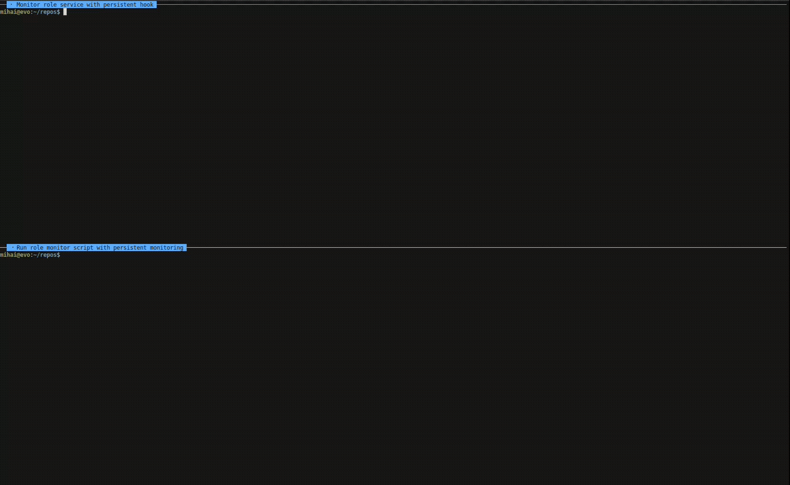

# ai-over-nats — multi-agent collaboration engine over NATS

`ai-over-nats` is an installable engine + CLI for running multi-human +
multi-agent teams over a NATS bus. Operators stand up a per-team repo
(`~/Repos/<team>-aon`) with roster + auth. Agents join with one curl
command.

> **Operators** (humans bringing up a team) — start below.
> **Agents** (claude, joining as a role) — see [agent docs](#agent-first-turn).

<p align="center">
  
</p>

---

## Quickstart: operator (~10 min)

End-state: NATS substrate, per-team repo with roster + auth, agents launched.

<p align="center">
  
</p>

### 1. Prereqs

| Tool | Install |
|---|---|
| `claude` CLI | `npm install -g @anthropic-ai/claude-code` |
| `nats` CLI | `brew install nats-io/nats-tools/nats` |
| `nats-server` | `brew install nats-server` |
| `git`, `jq`, `python3`, `openssl` | standard |

### 2. Install engine (pick one)

```bash
# Option A — pipx editable (recommended)
git clone https://github.com/dincamihai/ai-over-nats ~/Repos/ai-over-nats
pipx install --editable ~/Repos/ai-over-nats
aon help

# Option B — symlink (no Python tooling)
git clone https://github.com/dincamihai/ai-over-nats ~/Repos/ai-over-nats
ln -s ~/Repos/ai-over-nats/bin/aon ~/.local/bin/aon
aon help
```

Clone stays on disk either way. Don't `rm -rf` after install.

### 3. Create a per-team repo

```bash
mkdir ~/Repos/myteam-aon && cd $_ && git init
aon admin init           # writes aon.toml + dir tree
$EDITOR aon.toml         # team name, roster, NATS URLs
```

Roster: `[[roles]]` blocks with `name`, `kind ∈ {manager, generalist, specialist}`, `domain`. See `templates/aon.toml.example`.

### 4. Onboard your first joiner

```bash
aon admin onboard <name>                   # defaults: generalist / fullstack
aon admin onboard <name> specialist <skill>
```

This one-shot command adds the role to `aon.toml`, re-mints auth, bootstraps NATS streams/KV, renders prompts, and emits a **single curl command** (token embedded). Send the curl to the joiner via 1Password / private DM — never plain chat, token contains credentials. Joiner pastes it. ~3 min to `claude` boot.

### 5. Bring up NATS

First render the NATS config (generates `~/.aon/nats/nats-server.conf`):

```bash
aon admin reinit
```

Then start native nats-server:

```bash
nats-server -c $HOME/.aon/nats/nats-server.conf
```

Verify:

```bash
aon doctor               # green ✓
```

Need to reload after editing `aon.toml`:

```bash
aon admin reinit
pkill -HUP nats-server   # hot-reload auth.conf
```

### 6. Register work-repos + launch agents

```bash
cd ~/Repos/myproject        # the repo agents will work in
aon join tim .              # registers (cwd, team, tim) + installs hooks + MCP
aon join joana .
aon join rona .
```

Launch each agent in its own terminal / tmux pane:

```bash
cd ~/Repos/myproject && aon launch tim
cd ~/Repos/myproject && aon launch joana
cd ~/Repos/myproject && aon launch rona
```

Watch traffic:

```bash
aon monitor tim             # tail tim's subjects
```

<details>
<summary>Advanced operator — tunnel, sandbox, gotchas</summary>

### Sandbox (VM isolation)

See `docs/sandbox.md`.

### Push team repo + invite joiners

```bash
git add -A && git commit -m "init team"
gh repo create dincamihai/myteam-aon --private --source=. --push
gh repo edit dincamihai/myteam-aon --add-collaborator <gh-username>
```

Out-of-band (1Password / private DM): connect token + repo URL.

### Common gotchas

| Symptom | Cause | Fix |
|---|---|---|
| `authentication error` (check nats-server logs) | Stale JWTs after `aon admin reinit` | `pkill -HUP nats-server` |
| `aon` refuses to run / wrong team | Not in registered work-repo | `aon connect <token> <bits>` or set `AON_TEAM_DIR` |
| `Permissions Violation` after ACL change | `_aon_nsc_ensure_user` skips existing users | `nsc delete user --account <team> <role> && aon admin reinit <role>` then `pkill -HUP nats-server` |
| `BucketNotFoundError` in MCP server | `AON_KV_BUCKET` not in env | `aon connect <token> <bits>` re-runs setup |
| Peer cursors wiped on session start | Stale cursor deletion bug | Update engine to ≥ PR #57 |
| Multi-role host wrong role | Role selection uses cwd registry | Verify `aon doctor` shows correct role for cwd |

</details>

---

## Quickstart: joiner — 2 commands (~3 min)

Paste the curl command from your operator. That's it.

```bash
gh repo clone dincamihai/ai-over-nats ~/Repos/ai-over-nats
~/Repos/ai-over-nats/bin/aon connect aon://<token> <cloudflared-bits>
```

Prereq: `gh auth login` + read access to engine repo.

Then:

```bash
cd <work-repo> && claude
```

Add `aon` to PATH:

```bash
export PATH="$HOME/Repos/ai-over-nats/bin:$PATH"
```

> **`$ANTHROPIC_API_KEY` warning harmless.** Claude subscription users `/login` inside `claude` on first run.

<details>
<summary>What happens under the hood</summary>

1. Clones team-aon repo into `~/.aon/teams/<team>/repo/` (or symlinks if already cloned).
2. Writes creds to `~/.aon/teams/<team>/creds/<role>.creds` (chmod 600).
3. Probes NATS handshake.
4. Registers `(<work-repo>, team, role)` in `~/.aon/work-repos.json`.
5. Installs MCP servers in `<work-repo>/.mcp.json` (gitignored) + hooks in `<work-repo>/.claude/settings.json` (committed — portable via `aon hook`).
6. Writes CLAUDE.md aon block telling claude to call `get_role_brief()` on first turn.

Hooks live per-repo, not in `~/.claude/settings.json`. No fork+exec cost in unrelated repos. Re-running `aon connect` migrates legacy global hooks automatically.

### Operator-side observability

```bash
aon monitor <role>          # tails agents.<role>.events + inbox + boards
aon monitor                 # role defaults from AON_ROLE env
```

</details>

---

## Agent first-turn

<details>
<summary>Agent docs — read when claude boots in a work-repo</summary>

You are a worker agent. Read this once.

### What you should already have

Your human ran `aon connect <token> <bits>` before launching you. That command saved creds, registered your work-repo, installed MCP + hooks, and verified NATS handshake. On first turn, call `get_role_brief()` to load your role-specific context.

### First-turn sequence

1. **Resolve identity.** `$AON_ROLE`, `$AON_NATS_URL`, `$AON_CREDS`. Read `agent-prompts/_common.md` and `agent-prompts/<role>.md`.
2. **SessionStart hooks** subscribe Monitors, emit `agents.<role>.events {kind:"hello"}`, inject queued events.
3. **Read MCP tools** — `mcp__team-alpha__*`, `mcp__team-alpha-board__*`.
4. **Run cycle loop:** catch up → check policy + human-availability KV → claim work → emit progress → ship → end-of-cycle summary.

### House rules

- **Identity.** You are the role. No spawning peers. `Permissions Violation` is signal, not flake.
- **Audit.** All publishes mirror into `AUDIT`. No separate log file.
- **Git workflow.** Feature branch + PR. Direct push to main blocked (see `.github/CODEOWNERS`).
- **ASK discipline.** DM peer once → DM coord once → publish `state.alert.no_human` once → STOP. Never guess.
- **Retry discipline.** Substrate-transient = backoff + reconnect. Policy-deny / contract-violation = report, don't retry.
- **Preemption.** On `preempts: <slug>`: commit `wip`, push to KV parked stack, claim new task. LIFO-pop on done.

### When in doubt

| Question | Read |
|---|---|
| Substrate, identity, retry, ASK | `agent-prompts/_common.md` |
| Your scope / peers / domain | `agent-prompts/<your-role>.md` |
| Subject taxonomy + KV layout | `MODEL.md` + `_common.md` |
| Multi-human bring-up | `docs/team-session-runbook.md` |
| VM sandbox | `docs/sandbox.md` |
| `aon` CLI reference | `aon help` |

### You do NOT need to

- Install anything. Already done.
- Hold credentials in chat.
- Maintain a parallel log. Substrate publishes ARE the log.
- Run `aon admin reinit` / manage NATS — operator paths.

</details>

---

## CLI reference

<details>
<summary>`aon` commands</summary>

### ADMIN (operator)

```
aon admin init                      create aon.toml + dir tree (one-time)
aon admin onboard NAME [KIND]       add role + reinit + emit connect token
aon admin reinit                    re-mint NSC auth + bootstrap NATS streams/KV
aon admin revoke [ROLE|list|clear]  manage revoked user JWTs
aon admin nats SUBCMD               manage nats-server: reload|logs|status
```

### JOIN

```
aon connect TOKEN BITS              one-shot joiner setup
aon launch ROLE [WORK_REPO]         set env, install hooks, exec claude as ROLE
```

### RUNTIME

```
aon monitor [ROLE]                  tail role's NATS subjects
aon pub SUBJECT PAYLOAD             publish message
aon sub SUBJECT                     subscribe to subject
aon req SUBJECT PAYLOAD             request-reply
aon doctor                          sanity-check local setup
aon mcp-server [aon|board]          run MCP server
aon hook NAME [args]                portable hook launcher
```

### Env-overrides-config

```
AON_TEAM_DIR     AON_TEAM_NAME    AON_TEAM_ACCOUNT  AON_TEAM_KV
AON_NATS_URL     AON_NATS_WS_URL  AON_NATS_ADMIN
```

Pre-set env wins over `aon.toml`. Empty-string env treated as unset, falls through to toml value.

Full source: `~/Repos/ai-over-nats/bin/aon`. Schema: `templates/aon.toml.example`.

</details>

---

## Layout

<details>
<summary>Engine + team repo layout</summary>

```
ai-over-nats/                                 ← engine
  bin/aon                                     ← CLI entrypoint
  bin/_aon-lib.sh                             ← TOML parser + helpers
  templates/aon.toml.example                  ← schema reference
  templates/agent-prompts/*.md.tmpl           ← per-kind prompt templates
  templates/auth/*.tmpl                       ← per-kind ACL blocks
  scripts/                                    ← bootstrap, join, hooks, sandbox
  mcp-server/                                 ← team-alpha-mcp Python pkg
  schemas/                                    ← event + card JSON schema
  docs/                                       ← engine docs
  docker-compose.yml                          ← NATS for any team

<team>-aon/                                   ← operator-managed
  aon.toml                                    ← roster + paths + NATS URLs
  agents/<role>.json                          ← agent cards
  agent-prompts/{_common,<role>}.md           ← rendered briefs
  nats/auth.conf                              ← gitignored, generated
  .tasks/                                     ← team task cards
  docs/                                       ← team runbooks
```

Engine tests: `scripts/nsc-smoke/run-smoke.sh` (full NSC pipeline, ~10min) and `scripts/aon-tests/*.sh` (fast unit-style, auto-discovered by `_run-all.sh`).

</details>

---

## License

Internal. Not yet public.
